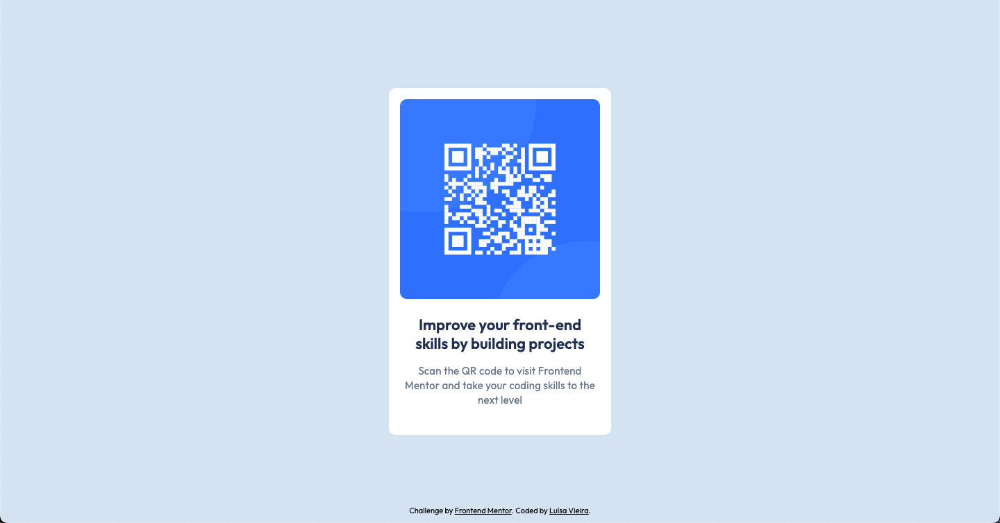

# Frontend Mentor - QR code component solution

This is a solution to the [QR code component challenge on Frontend Mentor](https://www.frontendmentor.io/challenges/qr-code-component-iux_sIO_H).

## Overview

### Screenshot

### Links

- Solution URL: [https://www.frontendmentor.io/challenges/qr-code-component-iux_sIO_H](https://www.frontendmentor.io/challenges/qr-code-component-iux_sIO_H)
- Live Site URL: [https://luisamrv.github.io/FM-QR-Code-Component/](https://luisamrv.github.io/FM-QR-Code-Component/)

## My process

### Built with

- Semantic HTML5 markup
- CSS custom properties
- Flexbox
- CSS Grid
- Mobile-first workflow

## Author

- Frontend Mentor - [@luisamrv](https://www.frontendmentor.io/profile/luisamrv)
